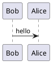
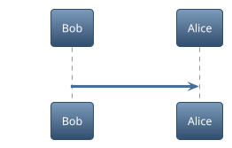
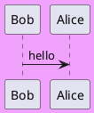
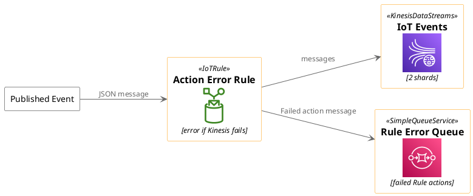
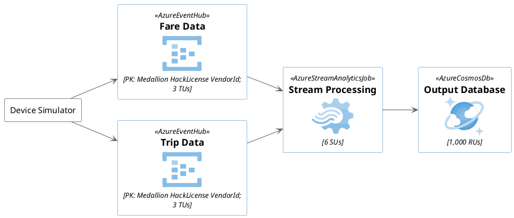
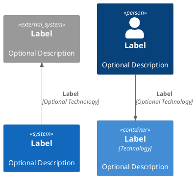
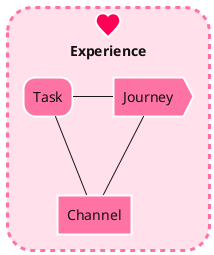
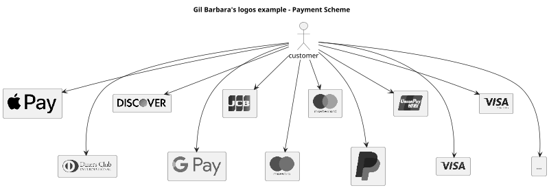
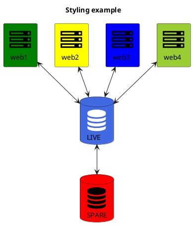

Render PlantUML embedded into the markdown post file.

Using the great [orefalo/markdown-it-plantuml-ex2](https://github.com/orefalo/markdown-it-plantuml-ex2).

# Simple PlantUML diagram

# Themed

# Background color

# Standard Library

## awslib

## azure

## C4

## edgy

## logos

## Icon Fonts (Fontawesome, Devicons) via tupadr3

