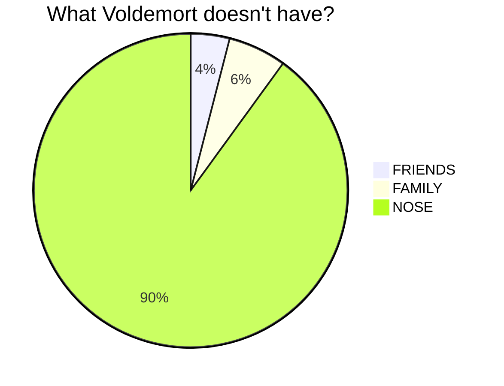
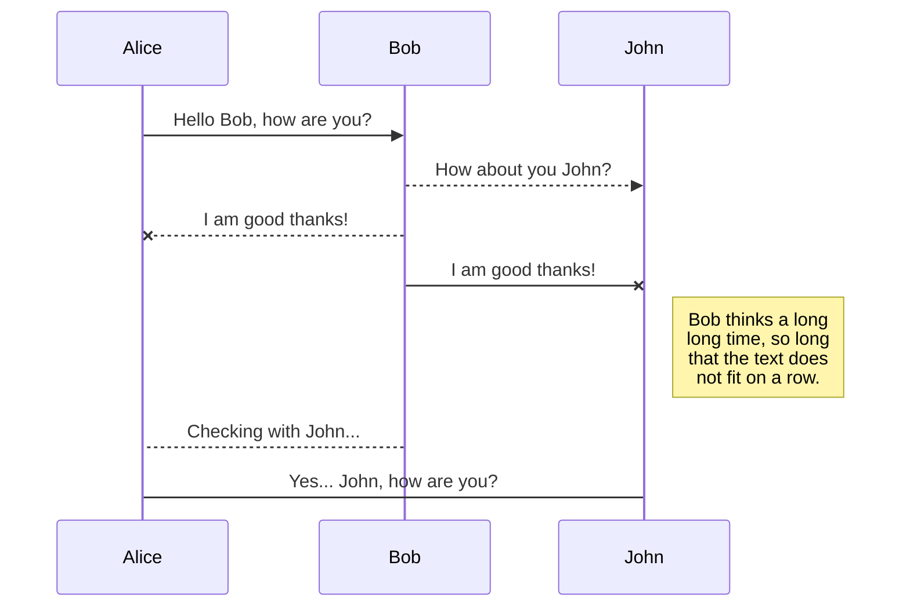
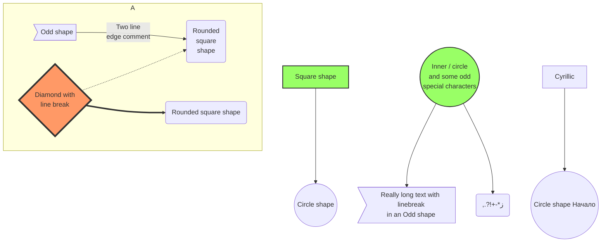
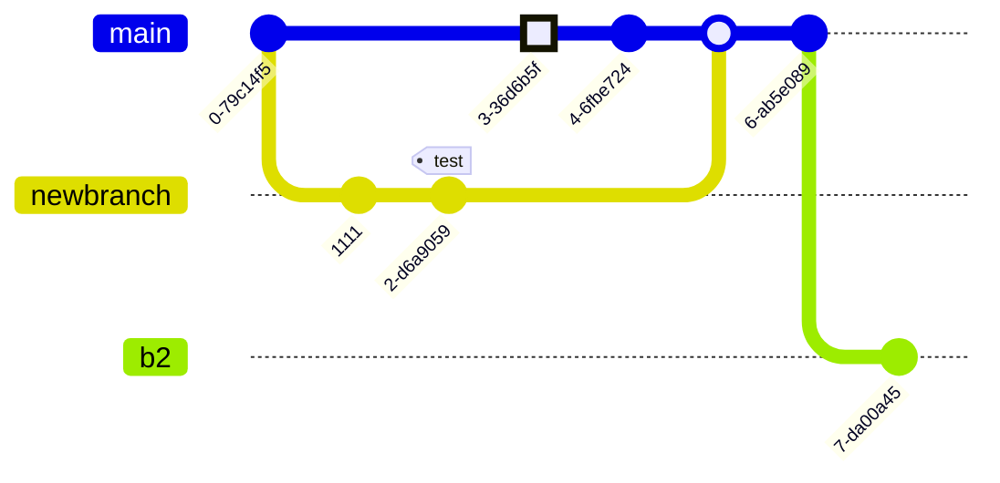
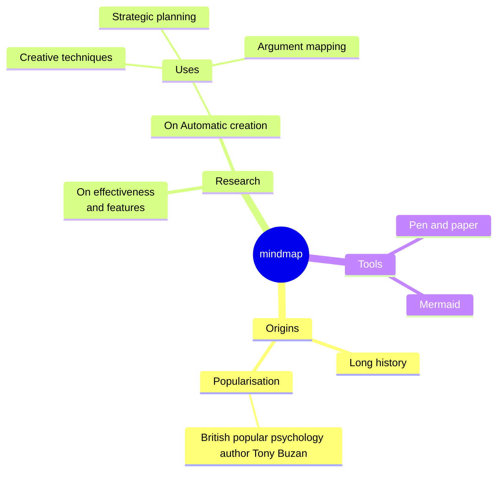
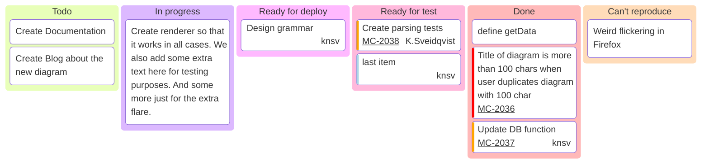
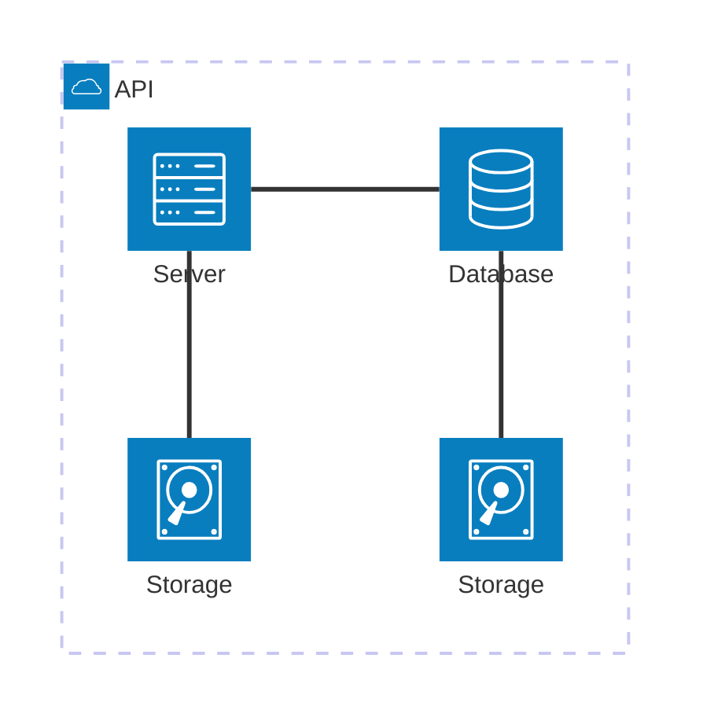
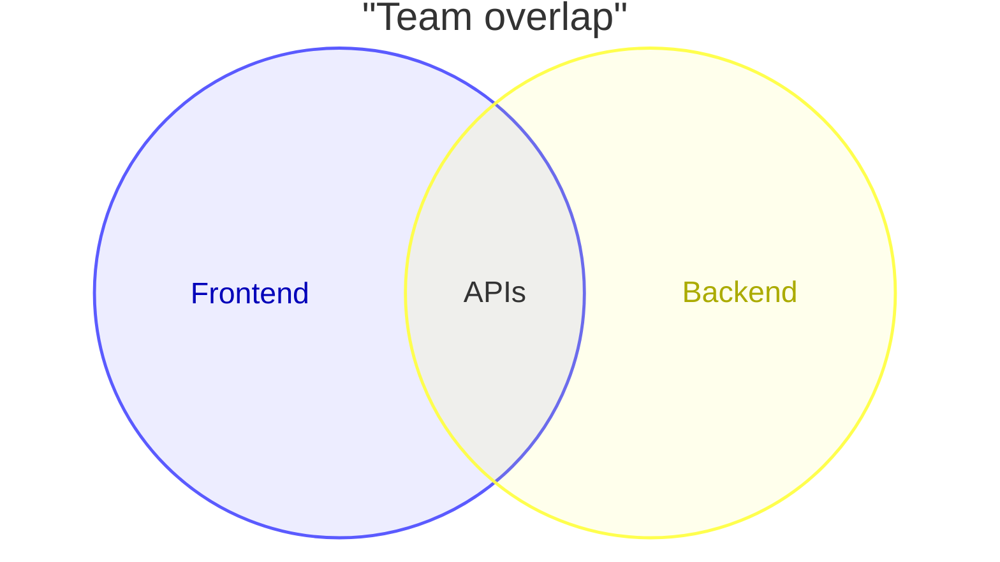
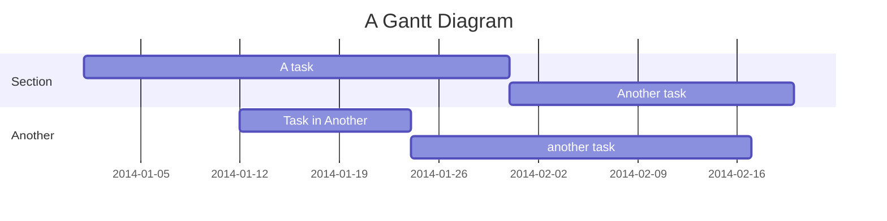

Taken from here:
<https://mermaid.ai/open-source/syntax/examples.html>

```mermaid
pie title What Voldemort doesn't have?
         "FRIENDS" : 2
         "FAMILY" : 3
         "NOSE" : 45
```

```mermaid
sequenceDiagram
    Alice ->> Bob: Hello Bob, how are you?
    Bob-->>John: How about you John?
    Bob--x Alice: I am good thanks!
    Bob-x John: I am good thanks!
    Note right of John: Bob thinks a long<br/>long time, so long<br/>that the text does<br/>not fit on a row.

    Bob-->Alice: Checking with John...
    Alice->John: Yes... John, how are you?
```

```mermaid
graph TB
    sq[Square shape] --> ci((Circle shape))

    subgraph A
        od>Odd shape]-- Two line<br/>edge comment --> ro
        di{Diamond with <br/> line break} -.-> ro(Rounded<br>square<br>shape)
        di==>ro2(Rounded square shape)
    end

    %% Notice that no text in shape are added here instead that is appended further down
    e --> od3>Really long text with linebreak<br>in an Odd shape]

    %% Comments after double percent signs
    e((Inner / circle<br>and some odd <br>special characters)) --> f(,.?!+-*ز)

    cyr[Cyrillic]-->cyr2((Circle shape Начало));

     classDef green fill:#9f6,stroke:#333,stroke-width:2px;
     classDef orange fill:#f96,stroke:#333,stroke-width:4px;
     class sq,e green
     class di orange
```

```mermaid
gitGraph:
    commit "Ashish"
    branch newbranch
    checkout newbranch
    commit id:"1111"
    commit tag:"test"
    checkout main
    commit type: HIGHLIGHT
    commit
    merge newbranch
    commit
    branch b2
    commit
```

```mermaid
mindmap
  root((mindmap))
    Origins
      Long history
      ::icon(fa fa-book)
      Popularisation
        British popular psychology author Tony Buzan
    Research
      On effectiveness<br/>and features
      On Automatic creation
        Uses
            Creative techniques
            Strategic planning
            Argument mapping
    Tools
      Pen and paper
      Mermaid

```

```mermaid
---
config:
  kanban:
    ticketBaseUrl: 'https://mermaidchart.atlassian.net/browse/#TICKET#'
---
kanban
  Todo
    [Create Documentation]
    docs[Create Blog about the new diagram]
  [In progress]
    id6[Create renderer so that it works in all cases. We also add some extra text here for testing purposes. And some more just for the extra flare.]
  id9[Ready for deploy]
    id8[Design grammar]@{ assigned: 'knsv' }
  id10[Ready for test]
    id4[Create parsing tests]@{ ticket: MC-2038, assigned: 'K.Sveidqvist', priority: 'High' }
    id66[last item]@{ priority: 'Very Low', assigned: 'knsv' }
  id11[Done]
    id5[define getData]
    id2[Title of diagram is more than 100 chars when user duplicates diagram with 100 char]@{ ticket: MC-2036, priority: 'Very High'}
    id3[Update DB function]@{ ticket: MC-2037, assigned: knsv, priority: 'High' }

  id12[Can't reproduce]
    id3[Weird flickering in Firefox]
```

```mermaid
architecture-beta
    group api(cloud)[API]

    service db(database)[Database] in api
    service disk1(disk)[Storage] in api
    service disk2(disk)[Storage] in api
    service server(server)[Server] in api

    db:L -- R:server
    disk1:T -- B:server
    disk2:T -- B:db
```

```mermaid
venn-beta
  title "Team overlap"
  set Frontend
  set Backend
  union Frontend,Backend["APIs"]
```

```mermaid
gantt
    title A Gantt Diagram
    dateFormat YYYY-MM-DD
    section Section
        A task          :a1, 2014-01-01, 30d
        Another task    :after a1, 20d
    section Another
        Task in Another :2014-01-12, 12d
        another task    :24d
```
